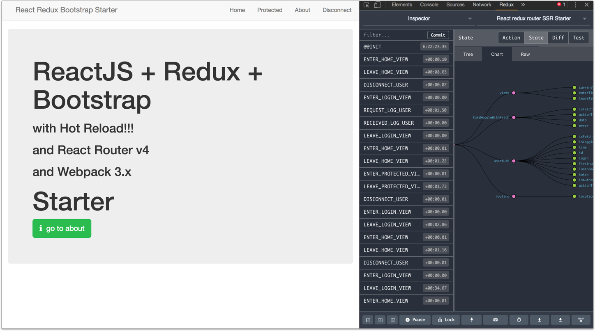

React + React-Router + Redux + Bootstrap with Server side rendering, Hot Reload and redux-devtools STARTER
==========
[](https://github.com/MacKentoch/react-redux-bootstrap-webpack-ssr-starter)
[](https://travis-ci.org/MacKentoch/react-redux-bootstrap-webpack-ssr-starter)
[](https://coveralls.io/github/MacKentoch/react-redux-bootstrap-webpack-ssr-starter?branch=master)

<a target='_blank' rel='nofollow' href='https://app.codesponsor.io/link/Mp96tCWH2KdajZuBzqB6jwj8/MacKentoch/react-redux-bootstrap-webpack-ssr-starter'>
  
</a>


`ReactJS` + `Redux` + `React-Router v4` + `Bootstrap` + `webpack 3` starter with `server side rendering` (*and hot reload for front dev*)



## Concept behind

This is a port of existing starter [react-redux-bootstrap-webpack-starter](https://github.com/MacKentoch/react-redux-bootstrap-webpack-starter#full-es2015-react--react-router--redux--bootstrap-with-hot-reload-and-redux-devtools-starter) where I added server side rendering.

## Detailed Content

**Front:**
- React JS (15.6.x+ - [github :link:](https://github.com/facebook/react))
- Redux (*as you application grows managing state will be a serious concern, save pain with Redux*)
- React-Redux (*Redux is not specific to ReactJS, you could easily use it with Angular2 for instance*)
- redux-devtools-extension ([github :link:](https://github.com/zalmoxisus/redux-devtools-extension#redux-devtools-extension))
- React-Router-Redux (*previously named react-simple-router*)
- react-router (4.x- [github :link:](https://github.com/reactjs/react-router))
- Bootstrap (3.x - [github :link:](https://github.com/twbs/bootstrap))
- React-Bootstrap ([github :link:](https://github.com/react-bootstrap/react-bootstrap))
- font-awesome ([github :link:](https://github.com/FortAwesome/Font-Awesome))
- animate.css ([github :link:](https://github.com/daneden/animate.css))
- classnames ([github :link:](https://github.com/JedWatson/classnames))
- react-motion ([github :link:](https://github.com/chenglou/react-motion))
- Webpack 3.x ([github :link:](https://github.com/webpack/webpack))
- babel 6+ ([github :link:](https://github.com/babel/babel))
- axios ([github :link:](https://github.com/mzabriskie/axios) *Why: simple, complete, isomorphic ...*)

**Tool chain:**
- babel 6+
- eslint
- hot reload
- loaders
  - `js` / `jsx`
  - sass
  - css
  - json
  - images formats
  - svg and fonts formats
- autoprefixer (css and sass)

**tests:**
- Mocha
- Chai (*+ dirty-chai*)
- enzyme
- Sinon
- nyc


## Usage

### Install

```bash
npm install
```
### bundle dev mode (*+ redux-devtools*)

```bash
npm run dev
```

### dev : hot reload mode (*+ redux-devtools*)

```bash
npm run start
```

### tests

```bash
npm run test
```

### bundle production mode


```bash
npm run prod
```

### mini node-express server for SPA

with server hot reload and dev bundle:
```bash
npm run serve-spa-dev
```

without hot reload and prod bundle:
```bash
npm run serve-spa-prod
```

### SSR server (prod bundle)

```bash
npm run serve-ssr
```


## License

The MIT License (MIT)

Copyright (c) 2017 Erwan DATIN

Permission is hereby granted, free of charge, to any person obtaining a copy of this software and associated documentation files (the "Software"), to deal in the Software without restriction, including without limitation the rights to use, copy, modify, merge, publish, distribute, sublicense, and/or sell copies of the Software, and to permit persons to whom the Software is furnished to do so, subject to the following conditions:

The above copyright notice and this permission notice shall be included in all copies or substantial portions of the Software.

THE SOFTWARE IS PROVIDED "AS IS", WITHOUT WARRANTY OF ANY KIND, EXPRESS OR IMPLIED, INCLUDING BUT NOT LIMITED TO THE WARRANTIES OF MERCHANTABILITY, FITNESS FOR A PARTICULAR PURPOSE AND NONINFRINGEMENT. IN NO EVENT SHALL THE AUTHORS OR COPYRIGHT HOLDERS BE LIABLE FOR ANY CLAIM, DAMAGES OR OTHER LIABILITY, WHETHER IN AN ACTION OF CONTRACT, TORT OR OTHERWISE, ARISING FROM, OUT OF OR IN CONNECTION WITH THE SOFTWARE OR THE USE OR OTHER DEALINGS IN THE SOFTWARE.
